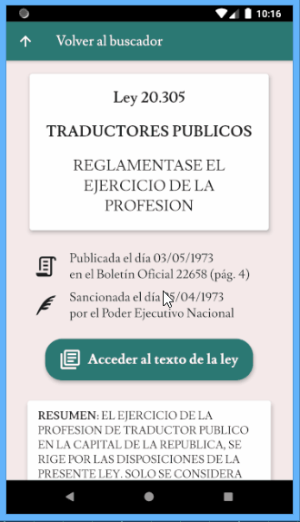
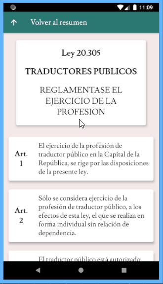

# infobootleg

 

Mobile app for playing around with data from InfoLeg, Argentina's legislative information service.

Built with Dart/Flutter and Firebase, for Android.

    
    &nbsp;&nbsp;&nbsp;&nbsp;
    
    &nbsp;&nbsp;&nbsp;&nbsp;
    

## Overview

Android app for retrieving laws from Argentina's [official legislative service](http://www.infoleg.gob.ar) and displaying their data in a user-friendly format, with article-by-article navigation, user authentication and support for favoriting articles and commenting.

    

Features:

- Full text/metadata retrieval from InfoLeg/Firestore
- Sign in via Google, Facebook, e-mail and incognito
- Search using Google Custom Search API
- Auth stream-based redirection flow
- NoSQL CRUD ops for laws and favorites
- HTML scraping and text parsing with RegEx
- State management with `Provider` and callbacks

## Installation

1. Clone repo
2. Get dependencies: `flutter pub get`
3. Run: `flutter run`

## Operation

### Sign-in flow

Sign in using a Google or Facebook account, e-mail/password or anonymously. In all cases, a user doc is created at Firestore to record the articles favorited by the user.

    
    &nbsp;&nbsp;&nbsp;&nbsp;
    

    
    &nbsp;&nbsp;&nbsp;&nbsp;
    

Based on Firestore's auth stream, the app redirects a signed-in user to the home screen and a signed-out user to the sign-in page. Signed-in status is preserved.

### Law search

At the main search screen, the user may search for a law by name or by number (vertical navigation), view their favorited articles (horizontal navigation) or sign out.

    
    &nbsp;&nbsp;&nbsp;&nbsp;
    

### Law summary

Searching for a law leads to the law summary screen, with Firestore's metadata for the queried law: official title, publication date, originating entity, summary text, etc.

**Modification relations** The laws and regulations that the query modifies and the laws and regulations that are modified by the query are accessed by tapping on the bottom icons.

    
    &nbsp;&nbsp;&nbsp;&nbsp;
    

### Law text

At the law summary screen, pressing the big green button brings up the law text screen, with InfoLeg's full text of the law parsed into articles, including a table of contents for ease of navigation.

**Favoriting articles** Long-pressing an article triggers a prompt for saving it as a user's favorite. Long-pressing a favorited article prompts for removal of the favorite.

    
    &nbsp;&nbsp;&nbsp;&nbsp;
    

### Favorites list

Back at the main search screen, the favorites button leads to the favorites list, which displays every article favorited by the user, including any comments added, also with a table of contents.

**Commenting on favorites** Tapping on the pen icon of a favorite leads to the comment screen, for commenting on the favorite. Save the comment using the keyboard; delete it using the cross icon. Since the favorites list is stream-based, any changes are reflected immediately.

    
    &nbsp;&nbsp;&nbsp;&nbsp;
    

### RegEx exceptions

Given InfoLeg's inconsistent formatting, it is expected that RegEx parsing may fail with a number of laws, in which case the native mobile browser is launched.

    
    &nbsp;&nbsp;&nbsp;&nbsp;
    

## TODOs

- Add tests!
- More exception handling.
- More RegEx patterns.
- Maybe favoriting entire laws.

## Author

© 2020 Iván Ovejero

## License

Distributed under the MIT License. See [LICENSE.md](LICENSE.md)
